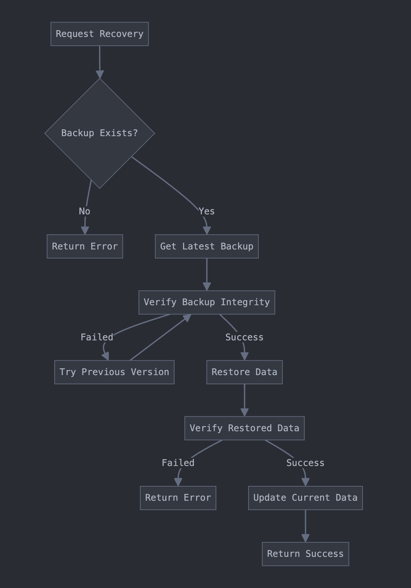

# Tamper Proof Data

At Bequest, we require that important user data is tamper proof. Otherwise, our system can incorrectly distribute assets if our internal server or database is breached. 

## Research and My Solution
After doing research, I looked at different ways to keep our data safe from tampering. Here's what I found:

### Blockchain
- First considered for its tamper-resistance capabilities
- Deemed too complex and performance-intensive
- Determined to be overengineered for the requirements

### Hardware Security
- Evaluated TPM and HSM solutions
- Found to be highly secure but cost-prohibitive
- Implementation across distributed systems would be challenging

### Special Databases
- Investigated WORM (Write Once Read Many) databases
- Considered append-only logging systems
- Insufficient security features for requirements

## Selected Approach
Opted for a multi-layered security solution incorporating verification systems and intelligent backup management, prioritizing simplicity and effectiveness over complexity.





## Production Implementation Requirements

- Background queue system for backup management
- Geographically distributed backup storage
- Request rate limiting implementation
- Enhanced monitoring and alert systems
- Automated backup retention management
- Hardware security for key storage
- Comprehensive audit logging
- Backup system health monitoring

## Main Security Questions

### 1. How does the client ensure that their data has not been tampered with?

#### Cryptographic Signatures
- Asymmetric cryptography implementation for data signing
- Dedicated KeyManager for secure key operations
- Signature verification for data integrity and authenticity

> 💡 Think of this like a unique fingerprint for your data. Each piece of data gets a special "signature" that can't be copied. Any modification invalidates the fingerprint.

#### Canary System
- CanaryManager implementation for integrity verification
- Early detection system for unauthorized changes
- Independent verification protocol

> 💡 Similar to a security guard checking ID at building entry. Each data access requires a valid token for verification.

#### Authentication Tags
- AES-GCM encryption with integrity verification
- Ciphertext integrity protection
- Immediate modification detection

> 💡 Comparable to a tamper-evident seal on medicine bottles - any tampering breaks the seal and alerts the system.

#### Version Control
- Version creation for all modifications
- Prevention of silent data changes
- Complete modification history

> 💡 Like taking a photo of each change, creating an unalterable record of modifications.

### 2. If the data has been tampered with, how can the client recover the lost data?


#### Automatic Backup System
- Pre-modification backup creation
- Multiple recovery point maintenance
- Secure backup storage implementation

> 💡 Similar to saving multiple copies of important documents in different secure locations.

#### Version Restoration
- Restoration capability to any valid version
- Integrity verification during restore operations
- Timestamped version history

> 💡 Functions like a time machine for data, allowing return to any verified previous state.

#### Emergency Recovery
- Automatic valid backup restoration
- Recovered data integrity verification
- Recovery operation API endpoints

> 💡 Acts as an automatic safety system, like sprinklers activating during a fire.

#### History Management
- Searchable version history system
- Manual recovery point selection
- Resource management through cleanup processes

> 💡 Similar to an organized filing system for backups with automatic cleanup of unnecessary files.

Edit this repo to answer these two questions using any technologies you'd like, there any many possible solutions. Feel free to add comments.

### To run the apps:
```npm run start``` in both the frontend and backend

## To make a submission:
1. Clone the repo
2. Make a PR with your changes in your repo
3. Email your github repository to robert@bequest.finance
